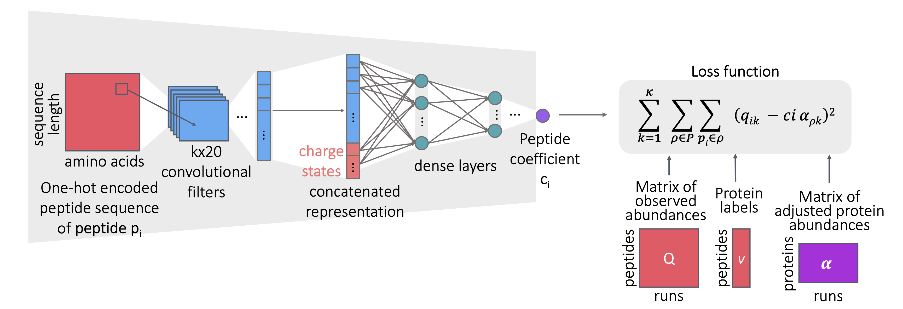

# Pepper

## Reducing peptide sequence bias from quantitative mass spectrometry data with machine learning

### Ayse B. Dincer

##### Paul G. Allen School of Computer Science & Engineering, University of Washington, Seattle

Quantitative mass spectrometry measurements of peptides necessarily incorporate sequence-specific biases that reflect the behavior of the peptide during enzymatic digestion, liquid chromatography, and in the mass spectrometer. We provide empirical evidence for the existence of such biases, and we use a deep neural network, called Pepper, to automatically identify and reduce these biases.
The model generalizes to new proteins and new runs within a related set of MS/MS experiments, and the learned coefficients themselves reflect expected physicochemical properties of the corresponding peptide sequences.
The resulting adjusted abundance measurements are more highly correlated with mRNA-based gene expression measurements than the unadjusted measurements.
Pepper is suitable for data generated on a variety of mass spectrometry instruments, using labeled or label-free approaches, and using data-independent or data-dependent acquisition.
  

---
---

## Pepper Pipeline

### 1. Data preprocessing

Folder **preprocess_datasets/** includes all scripts for preprocessing datasets.

**Preprocess_Peptide_Quants.ipynb** is the main script for preprocessing peptide quant matrices by applying filtering and one-hot encoding.

**onehot_encode_peptide_sequences.py** is the script for one-hot encoding a provided peptide quant matrix with peptide sequences.

### 2. Pepper Coefficient Predictor

**peptide_coefficient_predictor.py** is the main script for initializing and training a Pepper model. It takes the peptide filename (where the file should contain the peptide sequence, protein labels, and quants from runs), the number of runs, peptide sequence length, and the output filename. All the other network parameters are optional. The script defines the model with given parameters, trains until convergence, and records the final coefficient predictions along with train/test scores.

**train_models.sh** includes example calls for the datasets with the tuned parameters.

**Consistency_of_Sibling_Peptide_Abundances.ipynb** generates distribution plots of sibling and non-sibling peptide abundances for showing the consistency of peptide coefficients **(Figure 2)**.

**Create_Histograms_of_Sibling_Abundance_Differences.ipynb** generates histograms of difference between sibling peptide abundances before and after adjustment with the Pepper coefficients **(Figure 3A)**.

**Create_Plot_of_CVs.ipynb** generates scatter plots for comparing coefficient of variation before and after adjustment with the Pepper coefficients **(Figure 3B)**.

**Create_Plots_of_Protein_Abundances.ipynb** generates plots of peptide locations and abundances for the selected dataset and proteins **(Figure 4)**.

Folder **hyperparameter_tuning/** includes all scripts for tuning the hyperparameters of Pepper for the given dataset.

**gridseach_parameters_neural_network.py** is the script for training Pepper model with randomly selected hyperparameters from the grid.

**train_models.sh** includes example call for hyperparameter tuning.

### 3. Label Noise Experiments

Folder **label_noise_experiments/** includes all scripts for regenerating label noise experiments.

**train_neural_network_with_label_noise.py** is the script for initializing and training a Pepper model with label noise. It takes the peptide filename (where the file should contain the peptide sequence, protein label, and quants from runs), the number of runs, peptide sequence length, and the output filename. Another input is the ratio of non-sibling peptides for random shuffling.

**train_robust_neural_network_with_label_noise.py** is the script for initializing and training a robust Pepper model with label noise, defined similar to the non-robust model.

**tune_robust_neural_network_lambda.py** is the script for tuning the lambda value for the robust Pepper model.

**train_models.sh** includes example calls for the datasets with the tuned parameters.

**Create_Plots.ipynb** generates plots for comparing original and robust Pepper losses **(Figure 5)**.

### 4. Biological Relevance of Coefficients

Folder **biological_relevance_of_coefficients/** includes all scripts for regenerating biological relevance of coefficients experiments.

**Investigate_Peptide_Features.ipynb** is the script for investigating and plotting the association between AAindex peptide physicochemical features and inferred Pepper coefficients **(Figure 6A-B)**.

**Create_Substitution_Heatmaps.ipynb** is the script for generating amino acid substitution heatmaps with simulated sequences **(Figure 6C)**.

**Create_Substitution_by_Position_Plots.ipynb** is the script for generating amino acid substitution position plots with simulated sequences **(Figure 6D-E)**.

### 5. Linear Model Comparisons

Folder **linear_model_comparison/** includes all scripts for training linear regression models with k-mer counts for comparison to Pepper.

**1mer_count_linear_coefficient_predictor.py** is the script for initializing and training a linear model trained with the same loss as Pepper but takes as input amino acid counts for each sequence.

**2mer_count_linear_coefficient_predictor.py** is the script for initializing and training a linear model trained with the same loss as Pepper but takes as input 2-mer counts for each sequence.

**3mer_count_linear_coefficient_predictor.py** is the script for initializing and training a linear model trained with the same loss as Pepper but takes as input 3-mer counts for each sequence.

**train_models.sh** includes example calls for the linear models.

### 6. Utility of Pepper coefficients

Folder **utility_of_coefficients/** includes script for showing the utility of Pepper coefficients.

**Measure_Gene-Protein_Correlations.ipynb** is the script for measuring the correlation between the gene and protein expression before and after adjustment with Pepper coefficients **(Figure 7)**.

### 7. Run subsampling experiments

Folder **run_subsampling_experiments/** includes all scripts for training run subsampling experiments.

**peptide_coefficient_predictor_run_subsampling.py** is the script for training Pepper model with a subset of training runs.

**train_models.sh** includes example call for Pepper model.

**Random_Run_Subsample_Plots.ipynb** is the script for generating plots for run subsampling experiments **(Figure 8)**.

### 8. Transfer experiments

Folder **transfer_experiments/** includes all scripts for transferring Pepper across datasets.

**Combine_CPTAC_Datasets.ipynb** is the script for combining and preprocessing CPTAC datasets for joint learning.

**peptide_coefficient_predictor_transfer.py** is the script for loading the pretrained joint Pepper model and transferring it to a new dataset. 

**train_models.sh** includes example calls for joint training and transfer.

